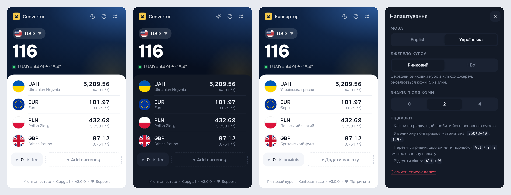

# ₴ Currency Converter

A fast, minimal multi-currency converter for Chrome. Type an amount once and see it in all your currencies, using either the live mid-market rate or the official National Bank of Ukraine rate.

**English** · [Українська](README.uk.md)



## Features

- **One big amount, many currencies.** Click any row to make it the main currency.
- **Two rate sources.**
  - *Mid-market*: aggregated market rate, refreshed every 5 minutes.
  - *NBU official*: the National Bank of Ukraine rate, set once per business day.
- **Math in the input:** `250*3+40`, `1200/4`, `1.5k`, `2m`. Both `1 234,50` and `1,234.50` work.
- **Fee / markup chip.** Add a bank card commission (e.g. `+2%`) to every converted value.
- **60+ currencies**, including crypto (BTC, ETH, USDT) and metals (XAU, XAG), with search by code or name.
- **Drag to reorder**, plus a row menu: make main, set as home currency, copy value, move to top, remove.
- **Copy all** puts every value on your clipboard in one click.
- **Light and dark theme**, following the system by default.
- **English and Ukrainian UI**, switchable in settings. Currency names are translated too.
- **Works offline** with the last cached rates. Fonts and flags are bundled, so there are no external loads.
- **Keyboard friendly**
  - <kbd>Alt</kbd>+<kbd>W</kbd> opens the popup
  - start typing digits anywhere and they go into the amount
  - <kbd>Alt</kbd>+<kbd>↑</kbd>/<kbd>↓</kbd> switches the main currency
  - <kbd>Esc</kbd> closes panels

## Install

### From a release (recommended)

1. Download the latest `currency-converter-vX.Y.Z.zip` from [Releases](../../releases) and unzip it.
2. Open `chrome://extensions` and turn on **Developer mode**.
3. Click **Load unpacked** and select the unzipped folder.

### From source

```bash
git clone <this-repo-url>
```

Then **Load unpacked** the cloned folder in `chrome://extensions`. There is no build step: it is plain HTML, CSS and JS.

Works in Chrome, Edge, Brave, Opera, Vivaldi and other Chromium browsers (Manifest V3).

## Rate sources

| Source | Endpoint | Updates |
|---|---|---|
| Mid-market (primary) | `cdn.moneyconvert.net/api/latest.json` | ~5 min |
| Mid-market (fallback 1) | [fawazahmed0/exchange-api](https://github.com/fawazahmed0/exchange-api) via jsDelivr / Cloudflare | daily |
| Mid-market (fallback 2) | [open.er-api.com](https://www.exchangerate-api.com/docs/free) | daily |
| NBU official | [bank.gov.ua](https://bank.gov.ua/ua/open-data/api-dev) | business days |

Rates are for information only. Before any real transaction, check with your bank.

## Privacy

The extension has no analytics, no tracking and no accounts. It only makes requests to the rate endpoints listed above. Your currency list and settings stay in `chrome.storage.local` on your device. See [PRIVACY.md](PRIVACY.md).

## Permissions

| Permission | Why |
|---|---|
| `storage` | Saves your currency list, settings and cached rates |
| `alarms` | Refreshes rates in the background every 5 minutes |
| `clipboardWrite` | Powers the "Copy value" / "Copy all" actions |
| host permissions | Fetch rates from the four endpoints above, and nothing else |

## Project structure

```
manifest.json      MV3 manifest
background.js      service worker: fetches, normalises and caches rates
popup.html/.css/.js  the UI
i18n.js            English / Ukrainian strings and currency names
currencies.js      currency list (code → flag, English name)
flags/             SVG flags (flag-icons, MIT)
fonts/             Onest (SIL OFL 1.1)
icons/             extension icons
scripts/build.ps1  packs a clean release zip into dist/
```

## Build a release zip

```powershell
powershell -ExecutionPolicy Bypass -File scripts\build.ps1
```

This creates `dist/currency-converter-v<version>.zip`, containing only the files the extension needs. Upload it to the Chrome Web Store or attach it to a GitHub release.

## Credits

- Flags: [flag-icons](https://github.com/lipis/flag-icons) by Panayiotis Lipiridis, MIT
- Font: [Onest](https://github.com/simpals/onest), SIL Open Font License 1.1

## Support

If this saves you a few clicks every day, you can [buy me a coffee on Donatello ♥](https://donatello.to/dmoroka).

## License

[MIT](LICENSE) © 2026 D.Morok
